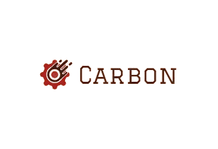

## Introduction

Carbon is a programming language designed, in C++, as a learning project. The name reflects the dual nature of carbon—under pressure, it creates diamonds, but without proper handling, it can become rubble. This project aims to explore compiler development and language design, with aspirations of evolving the compiler to be self-hosted.

## Features

- **Custom Language Design**: Experiment with syntax and semantics in a controlled environment.
- **Compiler Construction**: Understand the inner workings of how a compiler translates code into machine language.
- **Educational Focus**: Ideal for learning about low-level programming, language theory, and compiler technology.

## Table of Contents

- [Installation and Setup](#installation-and-setup)
- [Language Syntax](#language-syntax-and-features)
    - [Variables and Types](#variables-and-types)
    - [Control Structures](#control-structures)
    - [Functions](#functions)
    - [Example Program](#example-program)
- [Usage and Examples](#usage-and-examples)
    - [Writing Your First Carbon Program](#writing-your-first-carbon-program)
    - [Hello, World!](#example-hello-world)
- [Contribution Guidelines](#contribution-guidelines)
- [Future Goals](#future-goals)
- [License](#license)

## Installation and Setup

To get started with Carbon, you'll need a Linux operating system with `nasm` (Netwide Assembler) and `ld` (GNU Linker) installed. Follow these steps to clone the repository and build the compiler:

```bash
git clone https://github.com/SimaoFonseca2/Carbon --recursive
cd Carbon
mkdir build
cmake -S . -B build
cmake --build build
```

After these steps, you should find the `carbon` executable in the `build/` directory.

## Language Syntax and Features

Carbon is designed to be simple and approachable. Below are some basic constructs and syntax elements used in the Carbon language.

### Variables and Types

Carbon supports basic integer variable declarations. Here's an example of declaring a variable:

```carbon
let x = 10;
```
Note: The variables are only 1 byte sized for now and other types like strings are being developed.
### Control Structures

Carbon includes basic control structures like `if`, and `for`. Here’s how you can use them:

```carbon
if (x == 5) {
    // Code to execute if condition is true
}

for (let i = 0; i < 10; i++) {
    // Code to execute in the loop
}
```
Note: For loops only support less than `<` operations
### Functions

Functions in Carbon are not implemented for now as basic variables and control structures need either to be polished or implemented before functions can be implemented in a clean way.
The only function call you can make as of now is `print`.

### Example Program

Here’s a simple Carbon program that demonstrates variable declaration, control structures, and function calls:

```carbon
    let number = 10;
    if (number > 0) {
        print("Positive number");
    }
    return 0;
```

## Usage and Examples

Given its current development stage, Carbon is mostly suitable for educational purposes, particularly for those interested in learning about compiler construction and language design. Here are some potential use cases:

1. **Learning Compiler Development**: Use Carbon to understand how a compiler is built, from parsing to code generation.
2. **Experimenting with Language Features**: Test and experiment with new language features and see how they can be implemented in a compiler.
3. **Contributing to Open Source**: Collaborate with others in improving and extending the Carbon language.

### Writing Your First Carbon Program

To write and compile a Carbon program, follow these steps:

1. Create a file named `program.cb` and write your Carbon code in it.
2. Use the `carbon` compiler to compile your code:
   ```bash
   ./build/carbon program.cb -o program
   ```
3. Run the generated executable:
   ```bash
   ./program
   ```

### Example: Hello, World!

Here's a simple "Hello, World!" program in Carbon:

```carbon
    print("Hello, World!");
    return 0;
```

You may also use the `print` function to print the value of a variable by doing:

```carbon
	let x = 1;
    print(x);
    return 0;
```
Note: You can't use \n to do a breakline yet.

## Testing

Basic unit tests are implemented for the lexer, parser, and assemblygen classes using gtest library. 

## Contribution Guidelines

We welcome contributions from the community! Here’s how you can get involved:
1. **Fork the Repository**: Start by forking the project repository to your own GitHub account.
2. **Clone Your Fork**: Clone your forked repository to your local machine.
3. **Explore the Codebase**: Familiarize yourself with the project structure and existing code.
4. **Implement Changes**: Fix issues, add features, or improve documentation.
5. **Submit a Pull Request**: Once your changes are ready, submit a pull request for review.


## Future Goals

While Carbon is primarily an educational project, there are aspirations to:
- **Expand Language Features**: Add more complex constructs and capabilities to the language.
- **Achieve Self-Hosting**: Develop the compiler to a point where it can compile its own source code.
- **Enhance Learning Materials**: Create tutorials and resources to help others learn from the project.

## Known Bugs
- Declaring a for loop inside another for loops scope will cause undefined behaviour.
- Using print inside for loops cause undefined behaviour if you give it a string as an argument but will work fine with variables
- Return statement will only return values that can fit in 8 bytes(higher values than 255 will overflow into back to 0).

## License

This project is licensed under the Apache 2.0 License - see the [LICENSE](LICENSE) file for details.

---

For more information and to explore the source code, visit the [Carbon GitHub repository](https://github.com/SimaoFonseca2/Carbon).
